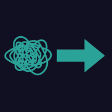

#  YACME: Yet Another Concept Map Helper

A live-editing concept map and diagramming tool with presentation mode support. Create interactive diagrams using a simple text syntax similar to simplified Graphviz.

Following the trails of [Garbuix](https://github.com/rberenguel/garbuix) and others I have written before.

## Features

- 🎨 **Live Preview**: See your diagram update as you type
- 📝 **Simple Syntax**: Text-based format that's easy to learn and version control
- 🎯 **Interactive Nodes**: Expandable sections with prose content
- 🎬 **Presentation Mode**: Create slides that progressively reveal your diagram
- 🔗 **Clickable Links**: Add URLs to nodes and edges
- 🎨 **Customizable Styling**: Inline CSS and class-based styling
- 🔍 **Icon Support**: Embed Iconoir icons in labels
- 💾 **Persistence**: Save/load diagrams to local storage

## Quick Start

### Style Preamble (Optional)

Define global default styles at the beginning of your diagram:

```
- nodeStyle="fill: #1a1a2e; stroke: #2aa198;"
- labelStyle="fill: #93a1a1;"
- edgeStyle="stroke: #cb4b16; stroke-width: 2;"
- edgeLabelStyle="fill: #b58900;"
- charWidth="12"
- lineHeight="24"
- baseHeight="60"
- widthPadding="50"
```

**Style directives** cascade to all nodes and edges, and can be overridden individually.

**Sizing directives** control node dimensions:

- `charWidth`: Pixels per character for node width (default: 9)
- `lineHeight`: Pixels per line for multi-line nodes (default: 18)
- `baseHeight`: Base height in pixels (default: 50)
- `widthPadding`: Width padding in pixels (default: 40)

### Basic Node

```
NodeId Label text
```

Example:

```
A First Node
B Second Node
```

### Basic Edge

```
SourceId -> TargetId edge label
```

Example:

```
A -> B connects to
```

## Syntax Reference

### Nodes

**Simple node:**

```
A Node Label
```

**Node with styling:**

```
A Node Label ; nodeStyle="stroke: red; fill: #222;" labelStyle="fill: orange;"
```

**Node with URL:**

```
A Click Me ; url="https://example.com"
```

**Multiline labels:**

```
A Line 1\\nLine 2\\nLine 3
```

### Edges

**Simple edge:**

```
A -> B
```

**Edge with label:**

```
A -> B connects to
```

**Edge with styling:**

```
A -> B relates ; nodeStyle="stroke: blue; stroke-width: 3;" labelStyle="fill: green;"
```

**Dotted edge (dashed lines):**

```
A -> B optional ; nodeStyle="stroke-dasharray: 5,5;"
```

**Edge without arrow:**

```
A -> B ; arrow="none"
```

**Edge with custom arrowhead color:**

```
A -> B ; nodeStyle="stroke: #dc322f;" arrowColor="#dc322f"
```

### Prose Sections (Expandable Content)

```
# NodeId

This content appears when you click the node to expand it.

You can include multiple paragraphs.

---
```

Example:

```
# Welcome

This is detailed information about the Welcome node.

Click the node to see this content!

---

Welcome Introduction
```

### Directives

Directives are key-value pairs added after a semicolon `;`.

#### Node Directives

| Directive      | Description                  | Example                                         |
| -------------- | ---------------------------- | ----------------------------------------------- |
| `nodeStyle`    | Inline CSS for the rectangle | `nodeStyle="stroke: red; fill: #222;"`          |
| `nodeClass`    | CSS class for the node       | `nodeClass="important"`                         |
| `labelStyle`   | Inline CSS for the text      | `labelStyle="fill: orange; font-weight: bold;"` |
| `labelClass`   | CSS class for the label      | `labelClass="highlight"`                        |
| `url`          | Makes node clickable         | `url="https://example.com"`                     |
| `charWidth`    | Pixels per character         | `charWidth="12"` (default: 9)                   |
| `lineHeight`   | Pixels per line              | `lineHeight="24"` (default: 18)                 |
| `baseHeight`   | Base height in pixels        | `baseHeight="60"` (default: 50)                 |
| `widthPadding` | Width padding in pixels      | `widthPadding="50"` (default: 40)               |

#### Edge Directives

| Directive    | Description              | Example                                      |
| ------------ | ------------------------ | -------------------------------------------- |
| `nodeStyle`  | Inline CSS for the path  | `nodeStyle="stroke: blue; stroke-width: 3;"` |
| `nodeClass`  | CSS class for the edge   | `nodeClass="important-edge"`                 |
| `labelStyle` | Inline CSS for the label | `labelStyle="fill: green;"`                  |
| `labelClass` | CSS class for the label  | `labelClass="small"`                         |
| `arrow`      | Arrow visibility         | `arrow="none"` to hide                       |
| `arrowColor` | Color of the arrowhead   | `arrowColor="#dc322f"`                       |
| `url`        | Makes label clickable    | `url="https://example.com"`                  |

### Icons

Embed icons using `:iconname:` syntax (from Iconoir font):

```
A :home: Home Node
B :user: User Profile
A -> B :arrow-right: navigates
```

### Complete Example

```
# Welcome

This is an introduction to the system.
Click to expand and see this content.

---

Welcome System Overview
A Data Layer ; nodeStyle="stroke: #2aa198;"
B Logic Layer ; nodeStyle="stroke: #268bd2;"
C UI Layer ; nodeStyle="stroke: #859900;"

A -> B provides data ; nodeStyle="stroke: #2aa198;" arrowColor="#2aa198"
B -> C renders ; nodeStyle="stroke: #268bd2; stroke-dasharray: 5,5;" arrowColor="#268bd2"
A -> C direct access ; arrow="none" nodeStyle="stroke: #dc322f; stroke-dasharray: 2,2;"
```

## Slides Feature

Create presentations that progressively reveal your diagram.

### Basic Slides

Add `# SLIDES` marker after your graph, then define slides separated by `---`:

```
A First Node
B Second Node
C Third Node

A -> B connects
B -> C leads to

# SLIDES

A
---
B
A -> B
---
C
B -> C
```

### Slide Syntax

**Add nodes:**

```
A
B
```

**Add edges:**

```
A -> B
```

**Remove items (from this slide onward):**

```
-A
-A -> B
```

**Auto-expand prose nodes:**

```
+Welcome
```

**Force-collapse prose nodes:**

```
~Welcome
```

### Slide Behavior

- **Incremental**: Each slide includes everything from previous slides
- **Empty slides**: Slides without references show nothing
- **Edge nodes**: Nodes in edges are automatically included
- **Exclusions**: `-` prefix removes items going forward
- **Expand state**: `+` expands prose nodes, `~` collapses them (useful after a `+` in previous slide)

### Complete Slides Example

```
# Intro

Detailed introduction content here.

---

Intro Introduction
A Concept 1
B Concept 2
C Concept 3

A -> B relates to
B -> C extends
A -> C bypasses ; nodeStyle="stroke-dasharray: 5,5;" arrow="none"

SLIDES

Intro
---
A
---
+Intro
B
A -> B
---
C
B -> C
---
A -> C
~Intro
```

This creates 5 slides:

1. Just "Intro" node (collapsed)
2. Intro + A
3. Intro (auto-expanded) + A + B + "relates to" edge
4. Intro + A + B + C + both solid edges
5. A + B + C + all edges including dotted, Intro (collapsed again)

### Presentation Mode

- **Enter**: `Cmd/Ctrl+Enter` (when slides are defined)
- **Exit**: `Escape`
- **Navigate**: Arrow keys or click buttons
- **Preview**: Cursor position in editor determines which slide previews

## Keyboard Shortcuts

| Shortcut           | Action                            |
| ------------------ | --------------------------------- |
| `Cmd/Ctrl+S`       | Save to local storage             |
| `Cmd/Ctrl+Shift+S` | Save as (new name)                |
| `Cmd/Ctrl+O`       | Open from local storage           |
| `Cmd/Ctrl+N`       | New diagram                       |
| `Cmd+E`            | Export standalone HTML            |
| `Cmd/Ctrl+Enter`   | Toggle presentation mode          |
| `Escape`           | Exit presentation mode            |
| `Arrow Left/Right` | Navigate slides (in present mode) |

## Styling Tips

### Dotted/Dashed Edges

```
A -> B dashed ; nodeStyle="stroke-dasharray: 5,5;"
A -> B dotted ; nodeStyle="stroke-dasharray: 2,2;"
A -> B long-dash ; nodeStyle="stroke-dasharray: 10,5;"
```

### Colored Arrows Matching Edges

```
A -> B red ; nodeStyle="stroke: #dc322f;" arrowColor="#dc322f"
A -> B blue ; nodeStyle="stroke: #268bd2;" arrowColor="#268bd2"
A -> B green ; nodeStyle="stroke: #859900;" arrowColor="#859900"
```

### Thick Edges

```
A -> B thick ; nodeStyle="stroke-width: 4px;"
```

### Custom Node Colors

```
A Red Node ; nodeStyle="stroke: #dc322f; fill: #3d1a1a;"
B Blue Node ; nodeStyle="stroke: #268bd2; fill: #1a2a3d;"
C Green Node ; nodeStyle="stroke: #859900; fill: #262d1a;"
```

## Technical Details

- **Editor**: CodeMirror 6 with markdown support
- **Rendering**: D3.js v7 for SVG manipulation
- **Layout**: Dagre for initial positioning, D3 force simulation for interactivity
- **Icons**: Iconoir font
- **Storage**: IndexedDB via idb-keyval

## Development

The codebase is organized into modules:

- `parser.js` - Parses the text format into graph data
- `diagram.js` - Renders and manages the SVG diagram
- `editor.js` - CodeMirror integration and live updates
- `file.js` - Save/load functionality
- `quiz.js` - Quiz/presentation mode

For detailed implementation notes, see [CLAUDE.md](CLAUDE.md).
